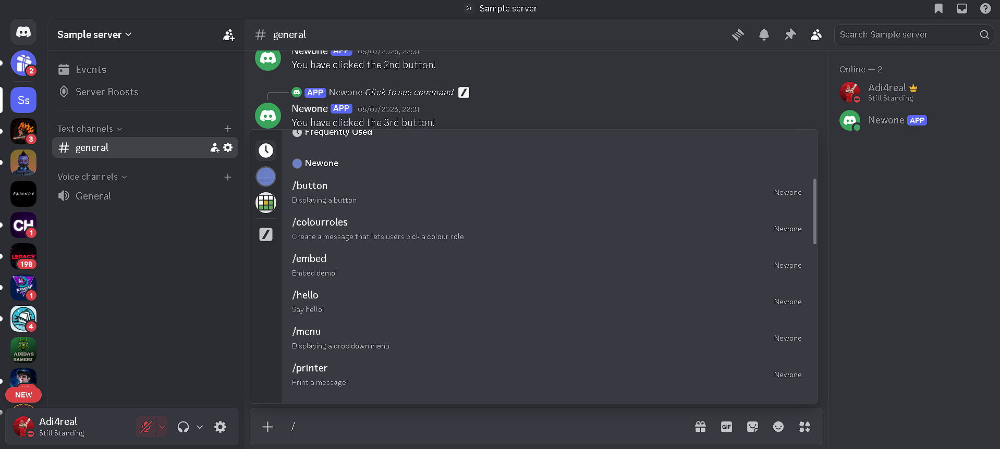
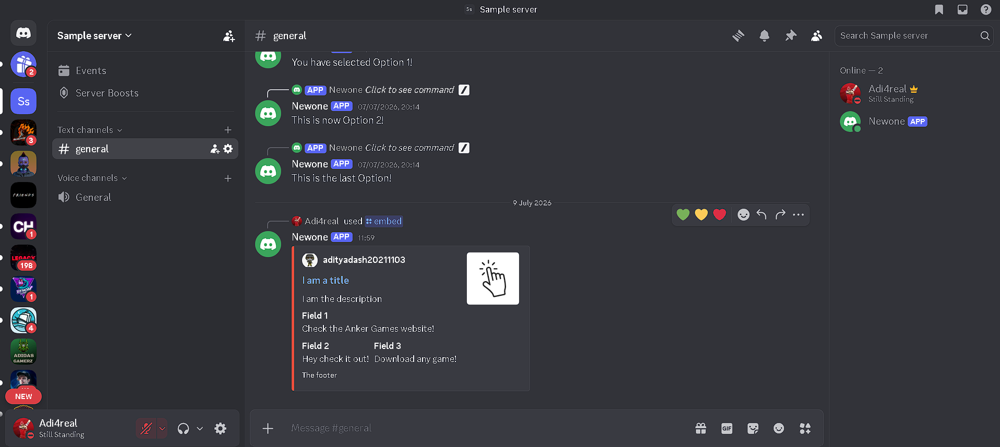
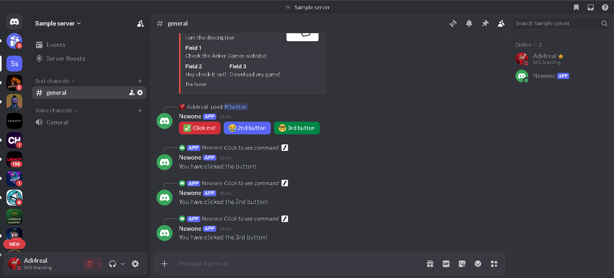
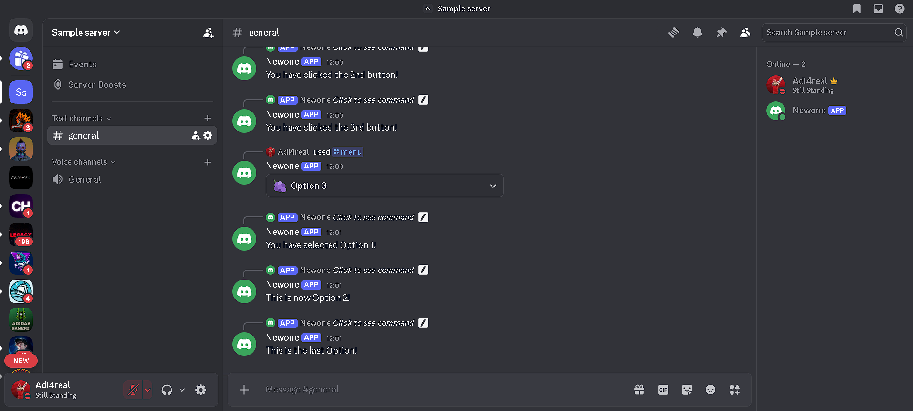
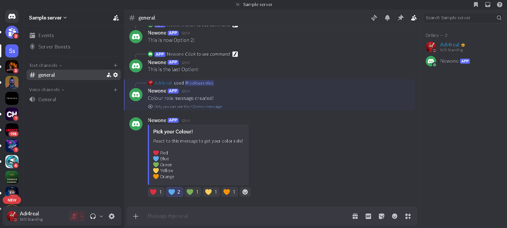

# Discord Role Management Bot

A Discord bot built using Python and discord.py.

## Features

- Slash Commands
- Rich Embeds
- Interactive Buttons
- Dropdown Menus
- Reaction Roles
- Automatic Role Assignment
- Automatic Role Removal
- Permission Checks

## Commands

- /hello
- /printer
- /embed
- /button
- /menu
- /colourroles

## Tech Stack

- Python
- discord.py
- Discord API
- Discord Developer Portal

## Installation

```bash
pip install -r requirements.txt
python main.py
```
## Screenshots

### Slash Command


### Embed Command


### Buttons


### Dropdown Menu


### Reaction Roles
